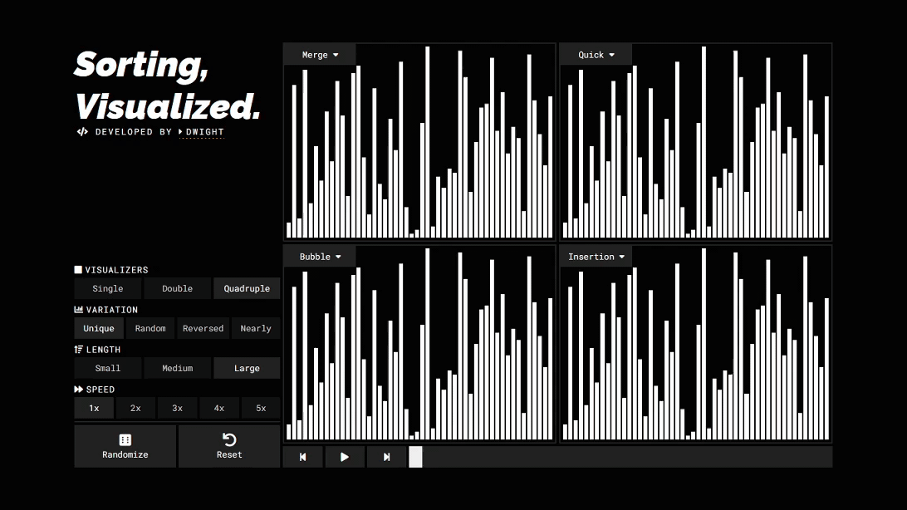
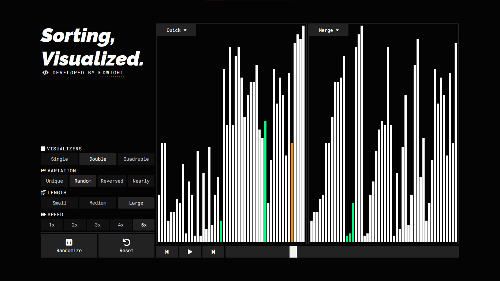
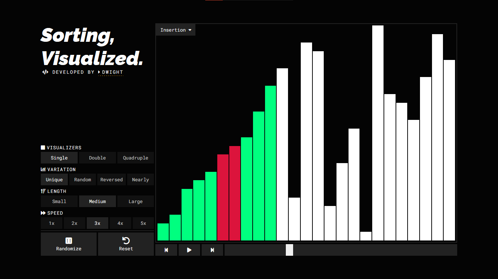
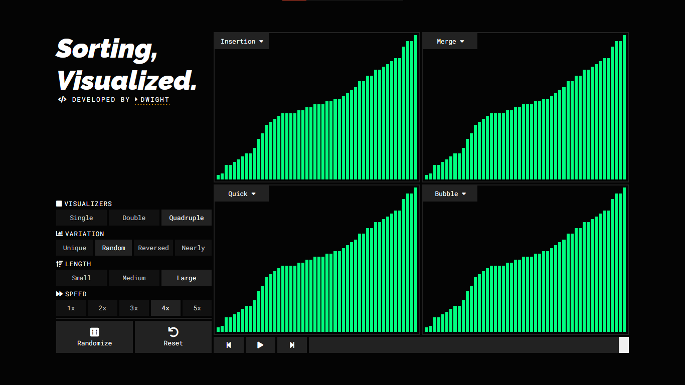
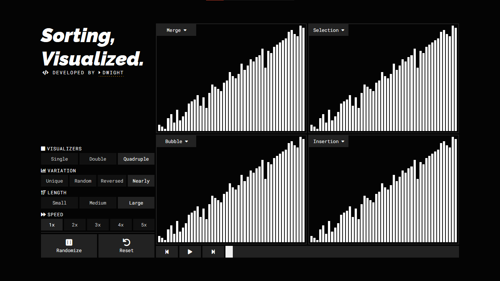

# Sorting, Visualized.

A slick looking and fully featured sorting visualizer. My own spin-off of the dozens sorting visualizers out there. This is primarily to reinforce my knowledge in algorithms and web development.

## Features

1. Visualize different Sorting Algorithms.

   - Selection Sort
   - Bubble Sort
   - Insertion Sort
   - Merge Sort
   - Quick Sort

2. Generate Arrays to Sort.

   - Choose Array Lenght (Small, Medium Large).
   - Choose Array Variation (Unique, Random, Reversed, Nearly Sorted).

3. Play and Pause Visualization in real-time.

   - Next and Previous buttons for step-by-step visualization.
   - Adjust visualization speed (1x to 5x).

4. Multi-Visualizations.
   - Single, Double and Quadruple screens.

## Setup

1. Clone the repository.

```bash
git clone https://github.com/Dwyte/sorting-visualized.git
```

2. Go to the directory and install Dependencies.

```
npm install
```

3. Run the project locally.

```
npm run start
```

4. Create a build.

```
npm run build
```

5. Deploy to github pages..

```
npm run deploy
```

## Demo



## Screenshots






